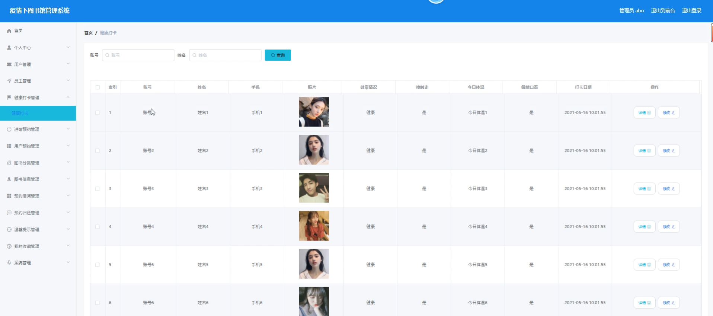
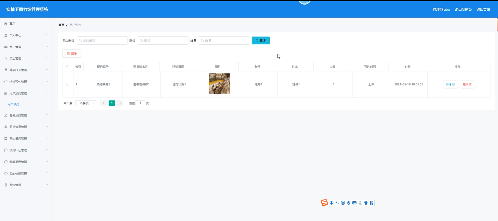
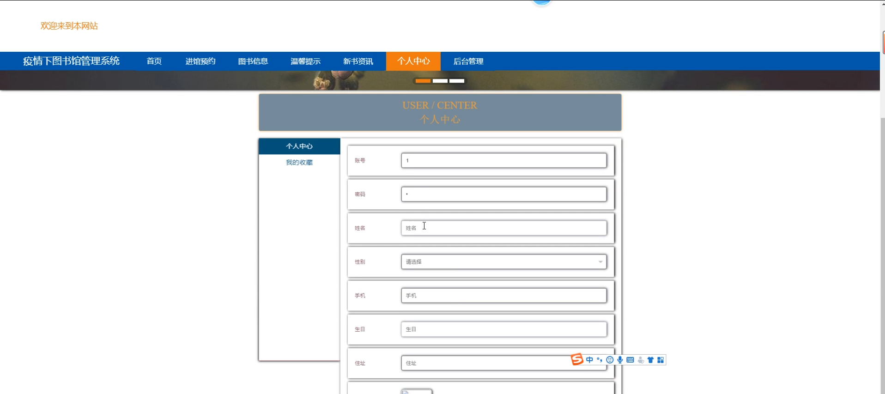

# 基于springboot的疫情下图书馆管理系统

<h4 style='color:red'>联系不到我，就看我的主页 </h4> 
 
#### 介绍

基于Spring Boot的疫情下图书馆管理系统，旨在疫情期间提供安全、便捷的图书馆管理服务。系统设计了三种角色：管理端、员工端和用户端，各角色拥有不同的功能模块，以实现高效的图书管理和用户服务。通过该系统，用户可以预约进馆、借阅图书，员工可以管理预约和图书信息，管理员则可以对整个系统进行综合管理。

#### 技术栈

后端技术栈：Springboot+Mysql+Maven

前端技术栈：Vue+Html+Css+Javascript+ElementUI

开发工具：Idea+Vscode+Navicate

#### 系统功能介绍

管理端功能模块  
个人中心：管理员可以管理个人信息，包括修改密码、更新联系方式等。  
用户管理：管理员可以查看、添加、修改和删除用户信息，管理用户的健康打卡和进馆预约记录。  
员工管理：管理员可以管理员工信息，包括添加、修改和删除员工，分配任务和权限。  
健康打卡管理：管理员可以查看和管理用户和员工的健康打卡记录，确保进馆人员的健康状态。  
进馆预约管理：管理员可以管理用户和员工的进馆预约申请，审核和安排进馆时间。  
用户预约管理：管理员可以查看和管理用户的图书预约情况，确保预约系统的正常运行。  
图书分类管理：管理员可以管理图书分类信息，添加、修改和删除图书类别。  
图书信息管理：管理员可以管理图书的详细信息，包括书名、作者、分类、库存等。  
预约借阅管理：管理员可以查看和管理用户的图书借阅预约，确保借阅流程顺畅。  
预约归还管理：管理员可以管理用户的图书归还预约，确保归还流程规范。  
温馨提示管理：管理员可以发布和管理温馨提示，向用户和员工提供重要通知和信息。  
我的收藏管理：管理员可以管理自己的收藏内容，快速访问常用功能和信息。  
系统管理：管理员可以进行系统设置和维护，包括权限管理、日志查看等。  

员工端功能模块  
进馆预约：员工可以查看和管理用户的进馆预约申请，确保进馆人数和时间安排合理。  
图书信息：员工可以查看图书的详细信息，帮助用户查询和借阅图书。  
温馨提示：员工可以查看管理员发布的温馨提示，了解最新通知和信息。  
新书资讯：员工可以查看和管理新书资讯，向用户推荐新书。  
个人中心：员工可以管理个人信息，包括修改密码、更新联系方式等。  
后台管理：  
预约借阅管理：员工可以查看和管理用户的图书借阅预约，协助借阅流程的进行。  
预约归还管理：员工可以查看和管理用户的图书归还预约，协助归还流程的进行。  

用户端功能模块    
进馆预约：用户可以在线提交进馆预约申请，选择进馆时间和日期。    
图书信息：用户可以查询图书的详细信息，包括书名、作者、分类、库存等。    
温馨提示：用户可以查看管理员发布的温馨提示，了解图书馆的最新通知和信息。    
新书资讯：用户可以查看新书资讯，了解图书馆的最新书籍和推荐。    
个人中心：用户可以管理个人信息，包括修改密码、更新联系方式等。    
后台管理：  
预约借阅管理：用户可以提交图书借阅预约申请，选择借阅图书和时间。  
预约归还管理：用户可以提交图书归还预约申请，选择归还时间和地点。  

#### 系统作用

该系统的主要作用包括：

提升疫情期间的图书馆管理效率：通过在线预约和健康打卡管理，减少进馆人数，确保安全。  
简化图书借阅和归还流程：用户可以在线提交借阅和归还申请，避免现场排队，提高效率。  
提供全面的图书信息和新书资讯：用户和员工可以方便地查询图书信息，了解最新书籍。  
加强信息交流和通知：通过温馨提示和新书资讯模块，管理员可以及时向用户和员工传达重要信息。  
个性化管理和服务：系统的个人中心和收藏管理功能，使用户和管理员可以定制和管理自己的信息和常用功能。  

#### 系统功能截图

代码结构

数据库表

登录

用户管理

员工管理

健康打卡管理

进馆预约管理

用户预约管理

图书信息管理

预约借阅管理

预约归还管理

前台页面个人中心

用户端后台管理

员工端后台管理

#### 总结

基于Spring Boot的疫情下图书馆管理系统通过科学的角色划分和详细的功能模块设计，实现了图书馆管理的高效化、智能化和安全化。系统为管理员、员工和用户提供了便捷的在线服务，优化了图书借阅和归还流程，提升了图书馆的管理效率和用户体验。通过健康打卡和进馆预约功能，系统在疫情期间确保了图书馆的安全运行，为用户提供了一个安全、便捷的信息查询和图书借阅平台。

#### 使用说明

创建数据库，执行数据库脚本 修改jdbc数据库连接参数 下载安装maven依赖jar 启动idea中的springboot项目

后台地址：http://localhost:8080/springbootp5hkd/admin/dist/index.html

管理员  abo 密码 abo

前台地址：http://localhost:8080/springbootp5hkd/front/index.html

